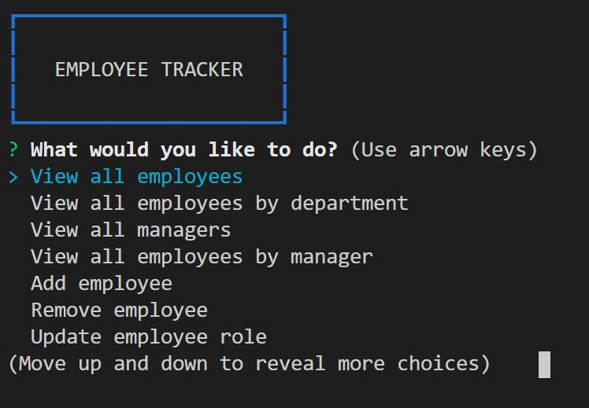
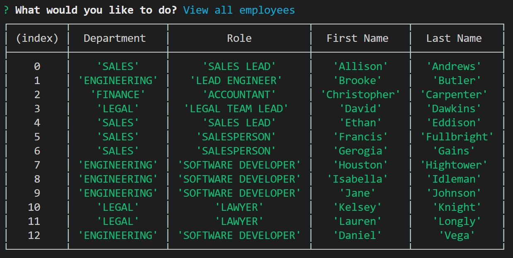
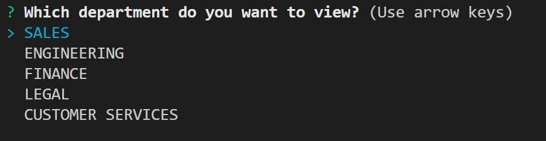
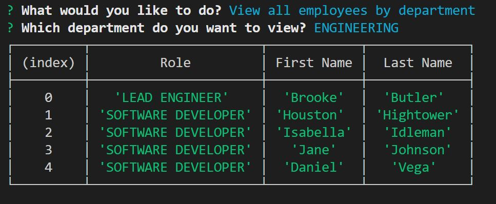

# Employee Tracker

Employee Tracker is an interface that makes it easy for non-developers to view and interact with information stored in a database. This app uses node, inquirer, and MySQL.

[Click] to see the video of the app being demoed.

## Description

Employee Tracker helps keep track of employees in a company; it let's you view, add, update, and remove employees, roles, and departments, and everything in between. Some of the functions at the users finger tips are:
* View all employees
* View all employees by department
* View all managers
* View all employees by manager
* Add employee
* Remove employee
* Update employee role
* Update manager status
* View all roles
* Add role
* Remove role
* Update role title
* Update salary
* View all departments
* Add department
* Remove department

## Usage
At the beginning of the app, the user is presented with a list of options to pick from.

When the user selects 'View all Employees', a table is displayed with the employees' department, role, and full name.

When ever the user wants to get information about departments, or roles, they are presented with a list that they can use arrow keys to scroll up or down. 

An example of the display when the user selects 'View all employees by department'.

## Tech

Note Taker users a number of open source projects to work properly:

* [node.js] - evented I/O for the backend
* [InquirerJs] - an easily embeddable and beautiful command line interface for node.js
* [MySql] - NPM package to connect to your MySQL database and perform queries

If you have more questions, you can hit me up on twitter @zlamdanielvega. 

  [node.js]: <http://nodejs.org>
  [MySql]: <https://www.npmjs.com/package/mysql>
  [jQuery]: <http://jquery.com>
  [InquirerJs]: <https://www.npmjs.com/package/inquirer/v/0.2.3>
  [Click]: <https://drive.google.com/file/d/1krwSpOLB4gy5WTb3YZfozcpAm_iHDeS8/view>
